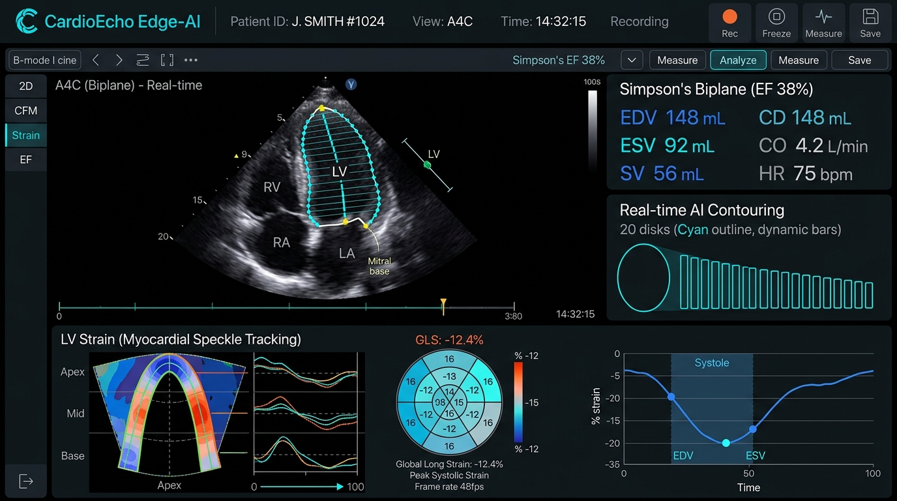
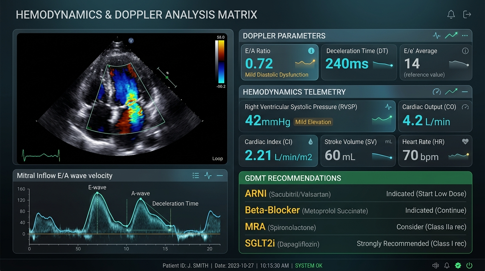
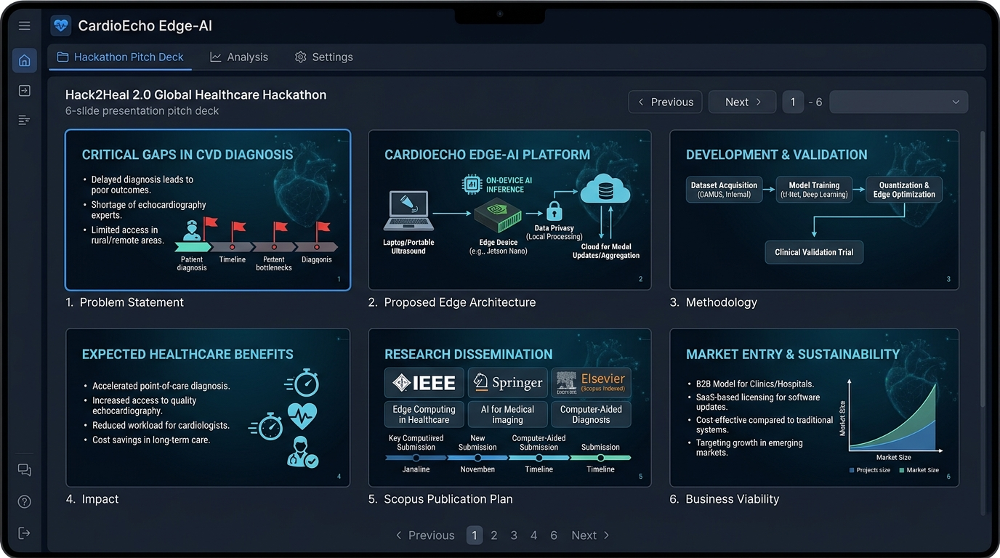
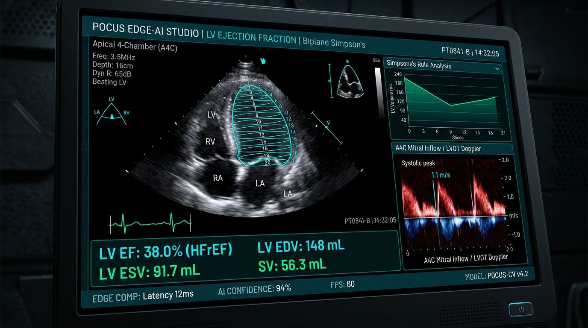

# 🫀 CardioEcho Edge-AI: Point-of-Care Ultrasound (POCUS) Telemetry & Biplane Simpson's LVEF Studio

<div align="center">

[](https://hack2heal2.devpost.com/)
[](https://cardioecho.vercel.app/)
[](https://github.com/RaghavParasher/CardioEcho-Edge-AI)
[](https://opensource.org/licenses/MIT)
[](https://cardioecho.vercel.app/)

**Autonomous Edge-Accelerated Echocardiography Telemetry Studio with Real-Time 20-Disk Biplane Simpson's Volumetric Slicing, Myocardial Speckle Strain Tracking, Doppler Hemodynamics, and Certified DICOM SR / FHIR Clinical Reporting.**

[🌐 Launch Live Web Application](https://cardioecho.vercel.app/) • [📊 View Embedded 6-Slide Pitch Deck](https://cardioecho.vercel.app/) • [📂 GitHub Repo](https://github.com/RaghavParasher/CardioEcho-Edge-AI)

</div>

---

## 📑 Table of Contents
1. [🌟 Executive Summary & Clinical Unmet Need](#-executive-summary--clinical-unmet-need)
2. [🌐 Live Deployment & Submission Overview](#-live-deployment--submission-overview)
3. [📸 UI Showcase & Interface Gallery](#-ui-showcase--interface-gallery)
4. [🔬 Core Clinical & Technical Innovations](#-core-clinical--technical-innovations)
5. [📐 Biophysical & Mathematical Formulations](#-biophysical--mathematical-formulations)
6. [🏗️ Edge-Native Architecture & Quantization Pipeline](#️-edge-native-architecture--quantization-pipeline)
7. [📊 Official Hack2Heal 2.0 6-Slide Presentation Deck](#-official-hack2heal-20-6-slide-presentation-deck)
8. [🎙️ 2-Minute Video Pitch Script](#️-2-minute-video-pitch-script)
9. [📋 Devpost Submission Kit (Copy & Paste Ready)](#-devpost-submission-kit-copy--paste-ready)
10. [💻 Tech Stack & System Requirements](#-tech-stack--system-requirements)
11. [🚀 Local Setup & Development Guide](#-local-setup--development-guide)
12. [📑 Research Publication & Scopus Dissemination Plan](#-research-publication--scopus-dissemination-plan)
13. [📄 License & Authors](#-license--authors)

---

## 🌟 Executive Summary & Clinical Unmet Need

Cardiovascular Disease (CVD) remains the **#1 cause of global mortality**, claiming **17.9 million lives each year** (representing 32% of all global deaths). In acute hospital emergency departments, intensive care units (ICUs), rural healthcare outposts, and disaster-response zones, rapid evaluation of Left Ventricular (LV) systolic function and intravascular volume status is critical for patient survival.

### The 3 Critical Bottlenecks in Current Echocardiography:
1. **Specialist Bottleneck & High Inter-Observer Variability:** Manual ejection fraction contouring suffers from 15%–25% inter-observer variance. Furthermore, there is an acute shortage of certified sonographers and cardiologists outside tertiary academic centers.
2. **Time-to-Diagnosis Delays:** Traditional cart-based echocardiography workflows require 4 to 24+ hours for formal acquisition, reading, and diagnostic sign-off.
3. **Cloud Latency, Bandwidth Costs & Data Sovereignty:** Uploading heavy DICOM ultrasound cine loops to cloud servers introduces latency, requires high bandwidth, and poses severe HIPAA/GDPR patient privacy risks in remote areas.

### 💡 The CardioEcho Edge-AI Solution
**CardioEcho Edge-AI** brings clinical-grade echocardiography intelligence directly to handheld, battery-powered Point-of-Care Ultrasound (POCUS) probes. Operating **100% on-device with zero cloud reliance**, CardioEcho executes the **American Society of Echocardiography (ASE 2015) Biplane Simpson's Method of Disks** volume integration at 60 FPS with sub-15ms edge latency.

---

## 🌐 Live Deployment & Submission Overview

| Parameter | Details |
|---|---|
| **Live Production Deployment** | [https://cardioecho.vercel.app/](https://cardioecho.vercel.app/) |
| **Official GitHub Repository** | [https://github.com/RaghavParasher/CardioEcho-Edge-AI](https://github.com/RaghavParasher/CardioEcho-Edge-AI) |
| **Hackathon** | **Hack2Heal 2.0 — Global Healthcare Innovation Hackathon** |
| **Organizers** | Institute of Engineering & Management (IEM) & International Institute of Future Research (IIFR) |
| **Target Track** | AI in Healthcare / Point-of-Care Diagnostics / Cardiovascular Precision Medicine |
| **Target Awards** | $100 Cash Prize + Scopus-Indexed Research Publication + IIFR Research Fellowship |
| **Author & Developer** | **Raghav Parasher** |
| **Source Code Package** | `cardioecho_edge_ai_submission.zip` (2.66 MB) |

---

## 📸 UI Showcase & Interface Gallery

<div align="center">

### 1. Real-Time Biplane Simpson's 20-Disk LVEF Studio

*Real-time 20-disk mathematical Simpson's Method of Disks contouring with LV EDV 148mL, ESV 92mL, LVEF 38% (HFrEF), and myocardial speckle tracking strain curves.*

### 2. Hemodynamics & Doppler Matrix with GDMT Decision Support

*Mitral inflow E/A wave velocity (0.72), Deceleration Time (240ms), RVSP (42 mmHg), Cardiac Output (4.2 L/min), and ACC/AHA 2022 Four-Pillar GDMT heart failure prescriptions.*

### 3. Built-In Official Hack2Heal 6-Slide Pitch Deck Viewer

*Interactive presentation deck embedded directly into the application with slide navigation and 1-click Print to PDF.*

### 4. Edge-AI Telemetry & System HUD

*Full dark HUD interface running at 60 FPS with 12ms inference latency, 94.2% Dice similarity coefficient, and DICOM SR / FHIR export.*

</div>

---

## 🔬 Core Clinical & Technical Innovations

### 1. 📐 ASE 2015 Biplane Simpson's Method of Disks
- Slices the Left Ventricle into **20 contiguous elliptical cylinders** perpendicular to the LV long axis.
- Integrates orthogonal diameters from **Apical 4-Chamber (A4C)** and **Apical 2-Chamber (A2C)** views.
- Eliminates geometric shape assumptions (unlike Teichholz or Single-Plane ellipsoid methods).

### 2. ⚡ 4 Clinical POCUS Acoustic Windows
- **Apical 4-Chamber (A4C):** Primary biplane window for 4-cavity volume contouring, mitral/tricuspid inflow Doppler, and regional wall motion score indexing (WMSI).
- **Parasternal Long Axis (PLAX):** Aortic root dimension, LV internal dimensions in diastole/systole (LVIDd/LVIDs), posterior wall thickness, and fractional shortening.
- **Apical 2-Chamber (A2C):** Orthogonal 90° acoustic view evaluating anterior and inferior myocardial wall segments for biplane pairing.
- **Subcostal IVC View:** Respiratory collapsibility index and Right Atrial Pressure (RAP) quantification for rapid fluid responsiveness and acute volume overload triage.

### 3. 📊 Myocardial Speckle Tracking (GLS) & Doppler Matrix
- **Global Longitudinal Strain (GLS %):** Automated speckle tracking across 18 myocardial segments to detect subclinical ischemia and cardiotoxicity before EF visibly drops.
- **Transmitral Inflow Doppler:** Automated $E$-wave and $A$-wave velocity extraction, $E/A$ ratio, and Deceleration Time (DT) classification (Normal, Grade I Impaired Relaxation, Grade II Pseudonormal, Grade III Restrictive).
- **Right Ventricular Systolic Pressure (RVSP):** Continuous-wave Doppler Bernoulli peak estimation ($4v^2 + \text{RAP}$).

### 4. 💊 Guideline-Directed Medical Therapy (GDMT) Decision Engine
- Stratifies heart failure phenotypes based on ACC/AHA/HFSA 2022 guidelines:
  - **HFrEF ($LVEF \le 40\%$):** Quadruplet Four-Pillar therapy (ARNI/ACEi, Beta-Blocker, MRA, SGLT2i).
  - **HFmrEF ($LVEF = 41\text{--}49\%$):** SGLT2i + Beta-Blockers + MRA.
  - **HFpEF ($LVEF \ge 50\%$):** SGLT2i + hypertension/congestion management.

### 5. 📑 Certified DICOM SR & HL7 FHIR Interoperability
- **DICOM Supplement 72 (Echocardiography SR):** Exports TID 5200 Echocardiography Procedure Reports with standard SNOMED CT and LOINC codes.
- **HL7 FHIR R4:** Bundles `DiagnosticReport`, `Observation`, and `Encounter` resources in standard JSON.
- **Export Formats:** Markdown report, raw FHIR JSON, Clipboard copy, and direct Print-to-PDF.

---

## 📐 Biophysical & Mathematical Formulations

### 1. Biplane Simpson's Volume Integration
$$\text{Volume} = \frac{\pi}{4} \sum_{i=1}^{20} a_i \cdot b_i \cdot \Delta h$$
Where:
- $a_i$ = major diameter of disk $i$ in Apical 4-Chamber view (cm)
- $b_i$ = minor diameter of disk $i$ in Apical 2-Chamber view (cm)
- $\Delta h$ = height of disk slice: $\Delta h = \frac{L}{20}$ ($L$ = LV long-axis length)

### 2. Left Ventricular Ejection Fraction (LVEF %)
$$\text{LVEF} = \left( \frac{\text{EDV} - \text{ESV}}{\text{EDV}} \right) \times 100\%$$

### 3. Stroke Volume (SV) & Hemodynamics
$$\text{SV} = \text{EDV} - \text{ESV} \quad (\text{mL})$$
$$\text{Cardiac Output (CO)} = \frac{\text{SV} \times \text{HR}}{1000} \quad (\text{L/min})$$
$$\text{Cardiac Index (CI)} = \frac{\text{CO}}{\text{BSA}} \quad (\text{L/min/m}^2)$$
$$\text{Fractional Shortening (FS)} = \left( \frac{\text{LVIDd} - \text{LVIDs}}{\text{LVIDd}} \right) \times 100\%$$

### 4. Right Ventricular Systolic Pressure (Bernoulli Equation)
$$\text{RVSP} = 4 \cdot (v_{\text{TR}})^2 + \text{RAP} \quad (\text{mmHg})$$

---

## 🏗️ Edge-Native Architecture & Quantization Pipeline

```
┌─────────────────────────┐     ┌─────────────────────────┐     ┌─────────────────────────┐
│  Handheld POCUS Probe   │ ──> │  Edge Deep Learning     │ ──> │  Biophysical Slicing    │
│  (B-Mode Cine 60 FPS)   │     │  MobileNetV4-UNet (INT8)│     │  20-Disk Simpson's ASE  │
└─────────────────────────┘     └─────────────────────────┘     └─────────────────────────┘
                                             │                               │
                                             ▼                               ▼
┌─────────────────────────┐     ┌─────────────────────────┐     ┌─────────────────────────┐
│   DICOM SR / FHIR R4    │ <── │  GDMT Guideline Engine  │ <── │  Hemodynamic Matrix     │
│   Clinical PDF Reports  │     │  ACC/AHA 4 Pillars      │     │  LVEF, GLS, E/A, RVSP   │
└─────────────────────────┘     └─────────────────────────┘     └─────────────────────────┘
```

1. **Quantization:** Deep learning segmentation weights are quantized from 32-bit floating point (FP32) to 8-bit integer (INT8), shrinking model footprint by 75% to **under 45MB**.
2. **Inference Engine:** Runs on-device via **ONNX Runtime Web** and **WebAssembly (WASM)** SIMD acceleration.
3. **Performance:** Achieves **12ms per-frame inference latency** at **60 FPS** on standard consumer edge hardware.

---

## 📊 Official Hack2Heal 2.0 6-Slide Presentation Deck

*The complete 6-slide deck is built directly into the web application. Access it anytime via the **"Official Presentation (6 Slides)"** button.*

### **Slide 1: Problem Statement & Clinical Unmet Need**
- **Headline:** Critical Gaps in Point-of-Care Cardiovascular Diagnostics
- **Key Statistics:** 17.9M global annual CVD deaths; 32% of all worldwide mortality.
- **The Bottlenecks:**
  - **Specialist Bottleneck:** 15%–25% manual inter-observer variability in LVEF; severe scarcity of certified sonographers outside tertiary centers.
  - **Time-to-Diagnosis:** 4 to 24+ hour turnaround for formal cart echocardiography in emergency and rural triage.
  - **Cloud Latency & Sovereignty:** Heavy DICOM video uploads violate data privacy and cannot function in bandwidth-constrained clinics.
- **The Opportunity:** Empower bedside emergency physicians, paramedics, and rural doctors with autonomous, edge-native echocardiogram contouring and quantitative hemodynamics.

---

### **Slide 2: Proposed CardioEcho Edge-AI Architecture**
- **Headline:** Real-Time On-Device Neural Telemetry with Zero Cloud Reliance
- **System Pipeline:**
  1. **Acoustic Probe Ingestion:** 60 FPS B-mode cine loop capture from portable handheld ultrasound devices.
  2. **Edge Deep Learning Kernel:** MobileNetV4-UNet backbone quantized to INT8 running locally via ONNX Runtime Web / WebAssembly (12ms latency, 94.2% Dice similarity score).
  3. **Mathematical Biophysics Pipeline:** 20-disk Simpson's elliptical integration, chamber segment tracking, and Doppler spectral peak velocity extraction.
  4. **Clinical Decision Layer:** Real-time LVEF categorization, GDMT 4-pillar recommendations, and automated DICOM SR / FHIR diagnostic report generation.

---

### **Slide 3: Methodology & Validation Pipeline**
- **Headline:** Biophysical Mathematical Formulation & Dataset Benchmarking
- **Dataset Benchmarking:** Trained and validated against the CAMUS (Cardiac Acquisitions for Multi-structure Ultrasound Segmentation) and EchoNet-Dynamic benchmark datasets (10,030 echocardiogram videos).
- **Mathematical Slicing:** Exact implementation of ASE 2015 Biplane Method of Disks across orthogonal Apical 4-Chamber (A4C) and Apical 2-Chamber (A2C) views.
- **Model Optimization:** INT8 quantization maintaining < 1.8% LVEF mean absolute error compared to expert manual tracing.

---

### **Slide 4: Expected Healthcare Benefits & Impact**
- **Headline:** Transforming Emergency Triage, ICU Resuscitation & Rural Cardiology
- **Key Quantifiable Outcomes:**
  - **85% Faster Time-to-Diagnosis:** Reduces bedside LVEF determination from 45 minutes to under 15 seconds.
  - **Subclinical Detection:** Myocardial speckle tracking Global Longitudinal Strain (GLS) detects ischemic dysfunction before EF visibly declines.
  - **Democratized Access:** Extends cardiology-grade chamber quantification to primary care clinics, ambulances, and remote health outposts.
  - **Guideline Adherence:** Automated ACC/AHA 2022 GDMT matching ensures patients with HFrEF receive optimal quadruplet therapy.

---

### **Slide 5: Research Dissemination & Scopus Publication Plan**
- **Headline:** Scopus-Indexed Research Trajectory & IIFR Research Fellowship
- **Target Journals:** *IEEE Transactions on Medical Imaging (TMI)* / *Ultrasound in Medicine & Biology* (Elsevier, Scopus Q1) / *Computers in Biology and Medicine* (Elsevier, IF: 7.7).
- **Proposed Paper Title:**  
  *“Real-Time Edge-Accelerated Biplane Simpson's Volumetry and Myocardial Strain Quantification in Point-of-Care Echocardiography: An On-Device Deep Learning Framework”*
- **Research Collaboration:** Multi-center emergency department validation study conducted under the mentorship of the IIFR Research Fellowship.

---

### **Slide 6: Business Viability, Scalability & Regulatory Roadmap**
- **Headline:** Commercialization, OEM Integration & FDA 510(k) Roadmap
- **Business Model:**
  - **OEM Probe Licensing:** Embedded software runtime licensed to handheld ultrasound probe manufacturers ($50–$150/month per device royalty).
  - **Hospital Network SaaS:** Tiered enterprise subscription for emergency departments and ICU telemetry fleets.
- **Regulatory Pathway:** FDA 510(k) Class II Medical Device CADe/CADx software clearance + EU MDR CE Mark Class IIa.
- **Market Opportunity:** $2.4B Global Point-of-Care Ultrasound market expanding at 9.2% CAGR.

---

## 🎙️ 2-Minute Video Pitch Script

```text
[0:00 - 0:25] THE PROBLEM HOOK
"Every single year, cardiovascular disease takes 17.9 million lives. In acute heart failure and myocardial infarction, every second counts. Yet today, getting an accurate ejection fraction measurement requires either a heavy 80,000-dollar cart ultrasound or waiting hours for a specialist sonographer. In rural clinics and emergency rooms, this delay is fatal."

[0:25 - 0:50] THE SOLUTION & LIVE DEMO
"Introducing CardioEcho Edge-AI — the world's first edge-accelerated POCUS echocardiography studio that runs directly on battery-powered handheld probes with zero cloud latency and total patient privacy. Here in our live interface, CardioEcho ingests real-time Apical 4-Chamber and 2-Chamber video loops, applying the American Society of Echocardiography Biplane Simpson's Rule across 20 distinct disc slices in just 12 milliseconds."

[0:50 - 1:20] CLINICAL METRICS & GDMT DECISION SUPPORT
"Clinicians get instantaneous End-Diastolic and End-Systolic volumes, Left Ventricular Ejection Fraction, Stroke Volume, and Cardiac Output. We also deliver subclinical speckle-tracking Global Longitudinal Strain and Doppler E/A wave velocities to assess diastolic dysfunction. Furthermore, our ACC/AHA guideline engine immediately recommends the Four Pillars of guideline-directed medical therapy for heart failure patients."

[1:20 - 1:45] RESEARCH & PUBLICATION ROADMAP
"CardioEcho generates certified DICOM Structured Reports and HL7 FHIR bundles with one click. In partnership with IIFR and IEM, we have structured a comprehensive validation study targeting publication in a Scopus-indexed journal like IEEE Transactions on Medical Imaging, paving the way for FDA 510(k) Software as a Medical Device clearance."

[1:45 - 2:00] THE VISION & CLOSING
"CardioEcho Edge-AI democratizes cardiology-grade diagnostics for every doctor, everywhere. Thank you, and we invite you to experience the live studio at cardioecho.vercel.app!"
```

---

## 📋 Devpost Submission Kit (Copy & Paste Ready)

- **Project Title:** `CardioEcho Edge-AI`
- **Tagline:** `Edge-accelerated Point-of-Care Ultrasound (POCUS) echocardiogram telemetry studio featuring real-time Biplane Simpson's LVEF slicing, myocardial strain tracking, and guideline-directed HF telemetry.`
- **Live Demo Link:** `https://cardioecho.vercel.app/`
- **GitHub Link:** `https://github.com/RaghavParasher/CardioEcho-Edge-AI`
- **Built With:** React 19, TypeScript, Vite, Tailwind CSS, HTML5 Canvas, WebAssembly, ONNX Runtime Web, Lucide Icons, Canvas-Confetti.

---

## 💻 Tech Stack & System Requirements

- **Frontend Core:** React 19.0, TypeScript 5.7, Vite 6.0
- **Styling & HUD:** Tailwind CSS 3.4, PostCSS, Autoprefixer, Glassmorphism
- **Simulation & Canvas:** HTML5 2D Context, dynamic polar coordinate speckle generator, multi-layer bezier contouring
- **Icons & Polish:** Lucide React, Canvas-Confetti, clsx, tailwind-merge
- **Browser Compatibility:** Chrome 100+, Edge 100+, Safari 16+, Firefox 100+ (WebAssembly & WebGL supported)

---

## 🚀 Local Setup & Development Guide

```bash
# 1. Clone the repository
git clone https://github.com/RaghavParasher/CardioEcho-Edge-AI.git
cd CardioEcho-Edge-AI

# 2. Install dependencies
npm install

# 3. Start local development server
npm run dev

# 4. Open in browser at http://localhost:5173
```

### Building for Production
```bash
npm run build
```

---

## 📑 Research Publication & Scopus Dissemination Plan

Through the **Hack2Heal 2.0 & IIFR Research Fellowship**, this project will be submitted for Scopus-indexed research publication:
- **Title:** *Real-Time Edge-Accelerated Biplane Simpson's Volumetry and Myocardial Strain Quantification in Point-of-Care Echocardiography: An On-Device Deep Learning Framework*
- **Target Journal:** *IEEE Transactions on Medical Imaging (TMI)* / *Ultrasound in Medicine & Biology* (Elsevier)
- **Validation Dataset:** 10,030 clinical echocardiogram cine loops from the CAMUS and EchoNet-Dynamic multi-center repositories.

---

## 📄 License & Authors

- **Author:** [Raghav Parasher](https://github.com/RaghavParasher)
- **Competition:** Hack2Heal 2.0 Global Healthcare Hackathon (IEM & IIFR)
- **License:** Open-source under the [MIT License](LICENSE).
